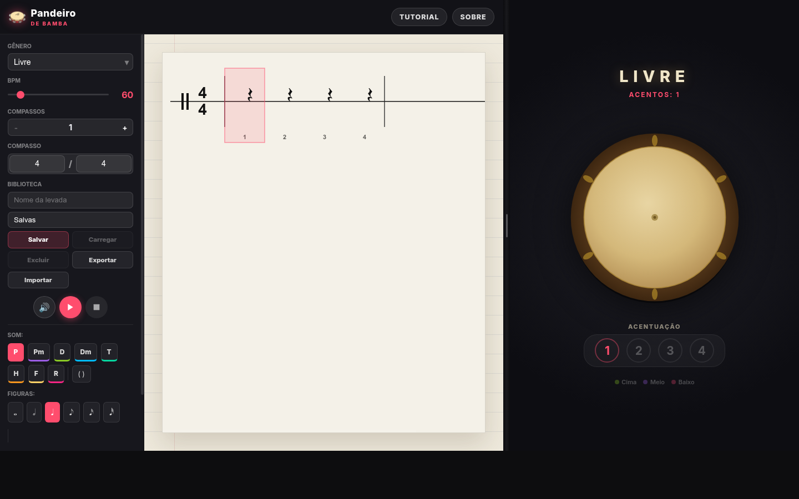

# Pandeiro de Bamba

Aplicativo web para criar, escrever, salvar e tocar levadas de pandeiro com uma notação própria para samba, choro e outros ritmos brasileiros.



## Demo

Aplicação em produção: [https://pandeiro-de-bamba.onrender.com/](https://pandeiro-de-bamba.onrender.com/)

O deploy no [Render](https://render.com) pode restringir o acesso por IP com a variável de ambiente `ALLOWED_IPS` (lista de endereços separados por vírgula, por exemplo `203.0.113.10,198.51.100.42`). Se `ALLOWED_IPS` não estiver definida, o site permanece aberto para qualquer visitante. A lógica está em `src/hooks.server.ts`.

No Render, defina também `ADDRESS_HEADER=true-client-ip`: esse cabeçalho é injetado pela borda do Render/Cloudflare com o IP real do cliente e não pode ser falsificado. Não use `X-Forwarded-For` no Render — lá ele chega como `cliente, Cloudflare, proxy interno`, e tanto o primeiro valor (falsificável pelo cliente) quanto os últimos (IPs internos) dão resultado errado.

Atrás de um proxy reverso próprio com um único hop confiável (ex.: nginx local), use `ADDRESS_HEADER=x-forwarded-for` e `XFF_DEPTH=1`. Sem nenhuma dessas variáveis, a checagem usa o endereço do socket — correto em execução direta, mas atrás de um proxy bloqueará todo o tráfego (falha fechado). Em caso de bloqueio indevido, o IP resolvido aparece nos logs do servidor (`[allowlist] acesso negado...`); lembre que clientes podem chegar via IPv6, e nesse caso o endereço IPv6 também precisa constar em `ALLOWED_IPS`.

Como alternativa (ou complemento) ao allowlist de IP, dá para travar o acesso com usuário e senha definindo `BASIC_AUTH_USER` e `BASIC_AUTH_PASSWORD` — mostra uma tela de login própria (`/login`) em vez do prompt nativo do navegador. Útil durante desenvolvimento, quando o IP de quem acessa muda com frequência. Se ambas as variáveis não estiverem definidas, essa trava fica desativada. Ao usar via Docker, passe as mesmas variáveis para o container — o `HEALTHCHECK` do [Dockerfile](Dockerfile) já envia as credenciais automaticamente quando presentes.

O Google Analytics 4 é opcional: defina `PUBLIC_GA_MEASUREMENT_ID` (ex.: `G-XXXXXXXXXX`) para ativar. Sem essa variável, nenhum script de analytics é carregado. Veja [.env.example](.env.example) para a lista completa de variáveis.

## Funcionalidades

- Editor de partitura em SVG com notas, pausas, figuras rítmicas, ponto de aumento e agrupamentos visuais.
- Pandeiro interativo que insere toques no cursor atual e destaca regiões de execução.
- Reprodução em loop com Web Audio API, BPM ajustável e metrônomo mutável.
- Controle de compasso e quantidade de compassos.
- Biblioteca local no navegador para salvar, carregar, excluir, importar e exportar levadas em JSON.
- Presets de gêneros para começar rapidamente.
- Build de produção com SvelteKit e adapter Node.

## Notação

A notação do Pandeiro de Bamba organiza os toques por região do instrumento e por forma visual da nota.

### Regiões

- **Cima**: toques na parte superior do couro ou aro.
- **Meio**: toques no centro do couro.
- **Baixo**: toques na parte inferior do couro ou aro.

Na pauta, a posição vertical da nota representa a região do toque:

- notas acima da linha indicam **Cima**;
- notas sobre a linha indicam **Meio**;
- notas abaixo da linha indicam **Baixo**.

### Sonoridades

| Símbolo | Toque                       | Região | Forma na pauta                            |
| ------- | --------------------------- | ------ | ----------------------------------------- |
| `P`     | Polegar                     | Baixo  | nota cheia                                |
| `H`     | Heel / pulso                | Baixo  | haste sem cabeça                          |
| `Pm`    | Polegar no meio             | Meio   | nota fantasma                             |
| `Dm`    | Dedos no meio               | Meio   | nota fantasma                             |
| `T`     | Tapa                        | Meio   | cabeça em `x`                             |
| `D`     | Grave com a ponta dos dedos | Cima   | nota cheia                                |
| `F`     | Finger / dedos              | Cima   | haste sem cabeça                          |
| `R`     | Rulo                        | Cima   | linha ondulada na pauta e `∞` no pandeiro |
| `P_mut` | Polegar abafado             | Baixo  | nota fantasma                             |
| `D_mut` | Grave abafado               | Cima   | nota fantasma                             |

### Formas visuais

- **Nota cheia**: som aberto/principal.
- **Cabeça em `x`**: platinela, tapa ou toque percussivo seco.
- **Nota fantasma**: toque suave ou abafado, desenhado entre parênteses.
- **Rulo**: movimento contínuo; aparece como linha ondulada na pauta e como símbolo de infinito no centro do pandeiro.

### Ritmo

O editor permite semibreve, mínima, semínima, colcheia, semicolcheia, fusa e semifusa, além de pausas equivalentes. O ponto de aumento adiciona 50% à duração selecionada.

## Stack

- SvelteKit
- Svelte 5
- TypeScript
- Vite
- Web Audio API
- SVG
- pnpm

## Requisitos

- Node.js 24 ou superior
- pnpm 10.28.0 ou superior

## Instalação

```sh
pnpm install
```

## Desenvolvimento

```sh
pnpm dev
```

Para abrir automaticamente no navegador:

```sh
pnpm dev -- --open
```

## Validação

```sh
pnpm run check
pnpm run test
pnpm run lint
pnpm run test:e2e
```

Para rodar a validação completa antes de publicar ou abrir um pull request:

```sh
pnpm run validate
```

Para incluir os testes E2E (requer `pnpm run test:e2e:install` na primeira vez):

```sh
pnpm run validate:all
```

Consulte [CONTRIBUTING.md](./CONTRIBUTING.md) para o fluxo completo de contribuição.

## Build

```sh
pnpm run build
```

Para pré-visualizar o build de produção:

```sh
pnpm run preview
```

## Docker

Este projeto usa a imagem oficial `node:lts-alpine`, mantendo a aplicação na linha LTS mais recente do Node, com runtime enxuto e usuário sem privilégios.

Build da imagem:

```sh
docker build -t pandeiro-de-bamba:latest .
```

Executar em produção:

```sh
docker run --rm -p 3000:3000 --read-only --cap-drop=ALL --security-opt=no-new-privileges:true --tmpfs /tmp:noexec,nosuid,size=64m pandeiro-de-bamba:latest
```

Ou usando Compose:

```sh
docker compose up --build -d
```

A aplicação ficará disponível em `http://localhost:3000`.

Para restringir acesso por IP (mesmo comportamento do Render), defina `ALLOWED_IPS` ao executar o container. Se o container estiver atrás de um proxy reverso próprio, acrescente `ADDRESS_HEADER=x-forwarded-for` e `XFF_DEPTH=1` (no Render, use `ADDRESS_HEADER=true-client-ip`):

```sh
docker run --rm -p 3000:3000 -e ALLOWED_IPS=203.0.113.10 \
  -e ADDRESS_HEADER=x-forwarded-for -e XFF_DEPTH=1 \
  pandeiro-de-bamba:latest
```

O `compose.yaml` publica a aplicação apenas em `127.0.0.1`, adequado para uso atrás de um proxy reverso local. Ele também habilita `init: true`, filesystem somente leitura, `tmpfs` limitado, remoção de capabilities, `no-new-privileges`, limite de processos, memória e CPU.

Para escanear a imagem com Trivy:

```sh
pnpm run docker:scan
```

## Estrutura

- `src/routes/+page.svelte`: layout principal, painel Sobre e integração entre partitura e pandeiro.
- `src/lib/components/ScoreEditor.svelte`: editor de partitura, biblioteca local e importação/exportação.
- `src/lib/components/PandeiroView.svelte`: pandeiro SVG interativo.
- `src/lib/state/`: estado global (partitura, editor, reprodução).
- `src/lib/audio/engine.ts`: engine de áudio (Web Audio API).
- `src/lib/types.ts`: tipos e catálogo de sonoridades.
- `src/lib/presets.ts`: levadas iniciais.

## Gerenciador de Pacotes

Este projeto é padronizado em `pnpm`. Use `pnpm-lock.yaml` como lockfile único e evite gerar `package-lock.json` ou `yarn.lock`.

## Licença

Este projeto é distribuído sob os termos da GNU Affero General Public License v3. Consulte [LICENSE](./LICENSE).
